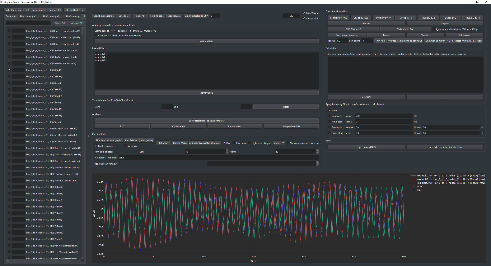
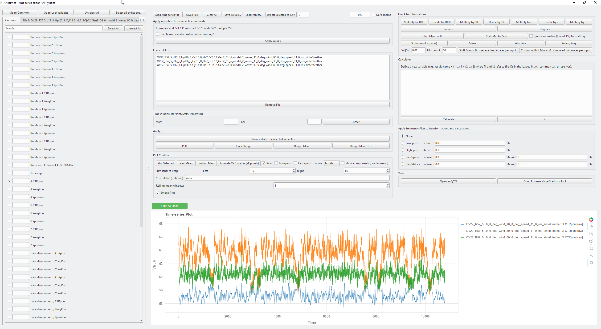
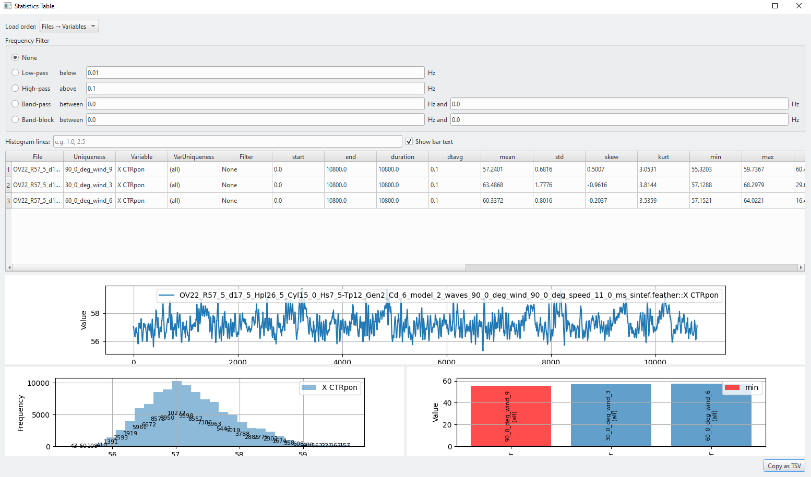

# ANYtimeSeries Documentation

ANYtimeSeries is a Qt-based application for exploring, editing and analysing time-series data. This guide covers the complete current feature set in the GUI, plus the programmatic utilities exposed by the package.

## Installation

Install the package from PyPI:

```bash
pip install anytimes
```

Core dependencies (including `numpy`, `pandas`, `scipy`, `PySide6`, `matplotlib`, `xarray`, `netCDF4` and `pyextremes`) are installed automatically.

## Launching the GUI

After installation, launch the editor either from Python:

```python
from anytimes import anytimes_gui
anytimes_gui.main()
```

or from the command line:

```bash
anytimes
python -m anytimes
```

## Basic Workflow

1. **Load data** – import one or more time-series files. Files with shared variables are grouped into *Common* tabs to speed up cross-file comparisons.
2. **Select and inspect variables** – tick variables of interest, apply offsets/scales, rename user variables and browse values.
3. **Transform or calculate** – run quick transforms, equation-based updates or full calculator expressions.
4. **Analyse and visualise** – create time plots, PSD/cycle plots, statistics tables, RAO estimates, fatigue summaries and extreme-value estimates.
5. **Export** – save whole files, export selected channels to CSV, or open selected data in AnyQATS.

## Supported File Types

The file loader accepts:

- **Time-series formats**: `csv`, `dat`, `ts`, `mat`, `h5`, `tda`, `asc`, `tdms`, `bin`, `pkl`, `pickle`.
- **Tabular formats**: `xlsx`, `json`, `feather`, `parquet`.
- **OrcaFlex simulations**: `.sim`, including object/variable selection and diffraction-based pressure extraction.

## Main Window Controls

### Variable navigation and selection
- **Go to Common / Go to User Variables** – jump within variable tabs.
- **Select All / Unselect All** – bulk tick/untick variables.
- **Select all by list pos.** – tick variables by row index across tabs.
- Per-variable controls include **input expressions**, **X/Y/Z markers**, and **Rename** (for user channels).

### File controls
- **Load time series file** – import one or many files.
- **Save Files** – write all currently loaded series.
- **Remove File / Clear All** – unload one file or reset the workspace.
- **Save Values… / Load Values…** – persist/restore offset and scale settings.
- **Export Selected to CSV** – write checked variables to one CSV, with optional resampling via `dt`.
- **Clear OrcaFlex Selection / Re-select OrcaFlex Variables** – reset and reopen OrcaFlex picks.
- **Reuse OrcaFlex Selection** – automatically apply the latest OrcaFlex object/variable mapping to future `.sim` files.
- **Dark Theme** and **Embed Plot** – appearance/plot-hosting toggles.

### Time-window controls
- **Time Window Start/End** with **Reset** – restrict transforms, analysis and plotting to a chosen interval.

### Quick transformations
- Scalar operations: multiply/divide by `1000`, `10`, `2`, and multiply by `-1`.
- Angle conversion: **Radians** / **Degrees**.
- Signal utilities: **Shift Mean → 0**, **Shift Min to Zero**, **Shift X Start → 0**, **Absolute**, **Mean**, **Rolling Avg**, **Sqrt(sum of squares)**.
- Advanced shifting: **Shift Min → 0 : if repeated minima as per input** and **Common Shift Min → 0 if same minima among selected var** using tolerance/count inputs.
- **Reduce Points** – downsample selected channels.
- **Merge Selected** – concatenate selected series end-to-end into a new user variable.

### Variable input operations
- **Apply Values** – apply inline formulas entered per variable (e.g., `*2`, `+0.4`).
- **Create user variable instead of overwriting?** – preserve originals by writing transformed results to user channels.

### Marked-axis tools
- **Plot X/Y(/Z)** – scatter selected variables using per-row X/Y/Z marker assignments.
- **Animate X/Y(/Z)** – animate marked coordinates over time.

### Frequency filter (global)
A shared filter selector provides **None**, **Low-pass**, **High-pass**, **Band-pass** and **Band-block** modes. The active filter affects transforms, statistics and analysis plots.

## Plot Controls

- **Plot Selected (one graph)** and **Plot Selected (side-by-side)**.
- **Plot Mean** and **Rolling Mean**.
- **Animate XYZ scatter (all points)** for 3-D trajectory animation.
- **Raw / Low-pass / High-pass** component toggles.
- **Same axes** option for side-by-side plots.
- Label trimming (left/right), custom Y-axis label, rolling-window size and optional X-axis marker.
- **Mark max/min** to annotate extremes.
- **Engine** chooser: `plotly`, `bokeh`, or built-in matplotlib backend.

## Calculator

The **Calculator** creates new variables with expressions such as:

```text
result_name = f1_varA + 0.5 * f2_varB
```

where `f1`, `f2`, etc. refer to loaded file IDs. It includes autocomplete and helper guidance (`?`) for syntax.

## Analysis Tools

### Statistics window
Opened by **Show statistic for selected variables**. Includes:

- sortable table of descriptive metrics,
- load-order toggle (Files→Variables or Variables→Files),
- histogram controls,
- shared frequency filtering,
- linked time-series/histogram plotting,
- **Copy selected as TSV** and **Copy all as TSV**.

### Spectral and cycle plots
Buttons in **Analysis**:

- **PSD** – power spectral density,
- **Cycle Range**,
- **Range-Mean**,
- **Range-Mean 3-D**.

### Extreme Value Statistics (EVM)
Opened by **Open Extreme Value Statistics Tool**. Features include:

- engine selection (SciPy GPD fit or PyExtremes POT workflow),
- upper/lower-tail mode,
- threshold estimation helper,
- confidence interval control,
- declustering controls and sweep plotting,
- return level and quantile diagnostics,
- iterative refit tooling.

### RAO estimator
Opened by **Generate RAO from Selected Time Series**:

- paired excitation/response transfer-function RAO,
- single-series spectral RAO (unit excitation assumption),
- amplitude/phase plotting,
- coherence plotting for paired mode,
- summary of peak RAO amplitude/frequency.

### Fatigue calculation tool
The package includes a fatigue workflow (rainflow counting + SN/TN damage models) through the `FatigueDialog` and `anytimes.fatigue` utilities. It supports:

- SN and TN curve-based calculations,
- built-in curve templates,
- optional filename-based exposure parsing (probability/exposure tokens),
- per-series damage summaries and aggregate life estimates.

## OrcaFlex Integration

When `.sim` files are loaded, ANYtimeSeries provides:

- object/variable pickers with live filtering,
- optional arc-length/extra-value input handling,
- batch application of selections across compatible simulations,
- reusable selection state for future imports,
- configurable redundant-substring stripping for cleaner labels,
- diffraction (`.owr`) pairing and **Extract Surface Pressures** for panel pressure time histories,
- caching of selections/diffraction metadata for faster reloads,
- frequency-domain fallback handling when bulk time-history extraction is unavailable.

## Programmatic Utilities (non-GUI)

In addition to the GUI, the package exposes reusable functions:

- `anytimes.evm` – extreme value helpers and return-level calculations.
- `anytimes.rao` – RAO estimation from time-series data.
- `anytimes.fatigue` – fatigue data structures, damage computation and result aggregation.
- `anytimes.gui.filename_parser` – parse embedded filename metadata (e.g., `Hs0_3`, `prob0_01`, `exposure12`).

## Command-Line Helpers

A Windows `.bat` launcher can be used to pin the GUI to a specific interpreter:

```batch
@echo off
C:\Python\Python313\python.exe C:\Github\ANYtimeseries\anytimes\anytimes_gui.py
pause
```

Update the paths to match your system.

## Screenshots





## License

Released under the MIT License. See [LICENSE](../LICENSE) for details.
