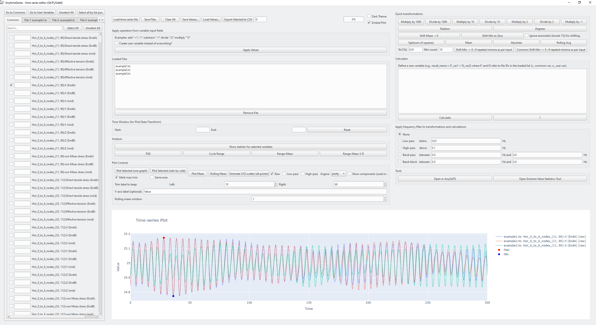

# ANYtimeSeries Documentation

ANYtimeSeries is a Qt-based application for exploring and editing time-series data. This document provides an overview of the application's capabilities and how to get started.

## Installation

Install the package from PyPI:

```bash
pip install anytimes
```

The core dependencies (``numpy``, ``pandas``, ``scipy``, ``PySide6``, ``matplotlib`` and ``anyqats``) will be installed automatically.

## Launching the GUI

After installation the GUI can be started from Python or from the command line.

```python
from anytimes import anytimes_gui
anytimes_gui.main()
```

or simply:

```bash
anytimes
```

## Basic Workflow

1. **Load data** – open one or more time-series files. The application automatically groups files with common variables for an efficient workflow.
2. **Inspect variables** – select variables and preview the data in table form.
3. **Manipulate series** – apply predefined operations or build custom expressions to create new series.
4. **Visualise** – choose from several plot types and engines (Plotly, Bokeh or Matplotlib) to explore the results.
5. **Export** – save modified series for later use.

## Advanced Features

- Frequency filtering for noise reduction.
- Equation-based transformations for complex processing.
- Extreme value statistics and a statistics table summarising key metrics.
- Support for OrcaFlex `.sim` files.
- Configurable light and dark themes for comfortable viewing.

## Command Line Helpers

For quick access you can create a small batch script that launches the GUI with a specific Python interpreter:

```batch
@echo off
C:\Python\Python313\python.exe C:\Github\ANYtimeseries\anytimes\anytimes_gui.py
pause
```

Update the paths to match your environment.

## Screenshots





## License

Released under the MIT License. See [LICENSE](../LICENSE) for details.

