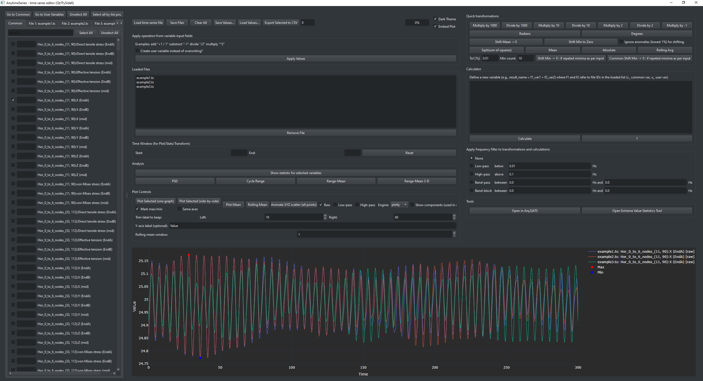
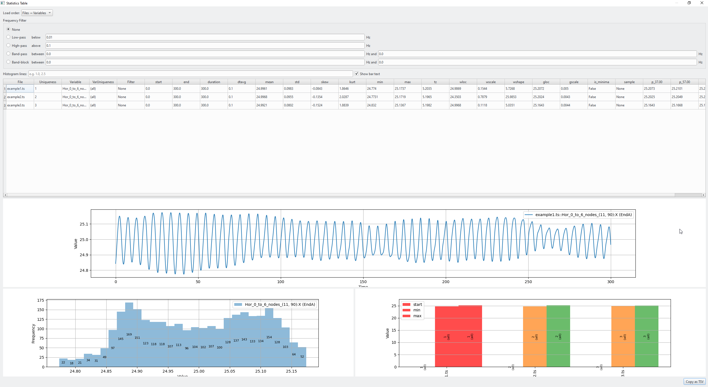

# ANYtimeSeries Documentation

ANYtimeSeries is a Qt-based application for exploring and editing time-series data. This document provides an overview of the application's capabilities and how to get started.

## Installation

Install the package from PyPI:

```bash
pip install anytimes
```

The core dependencies (``numpy``, ``pandas``, ``scipy``, ``PySide6``, ``matplotlib`` and ``anyqats``) will be installed automatically.

## Launching the GUI

After installation the GUI can be started from Python or from the command line.

```python
from anytimes import anytimes_gui
anytimes_gui.main()
```

or simply:

```bash
anytimes
```

## Basic Workflow

1. **Load data** – open one or more time-series files. The application automatically groups files with common variables for an efficient workflow. When loading OrcaFlex studies you can optionally preload `.sim` files so that object/variable listings appear instantly.
2. **Inspect variables** – select variables and preview the data in table form.
3. **Manipulate series** – apply predefined operations or build custom expressions to create new series.
4. **Visualise** – choose from several plot types and engines (Plotly, Bokeh or Matplotlib) to explore the results.
5. **Export** – save modified series for later use.

## Advanced Features

- Frequency filtering for noise reduction.
- Equation-based transformations for complex processing.
- Extreme value statistics and a statistics table summarising key metrics.
- Support for OrcaFlex `.sim` files, including reusable selections and diffraction-based surface pressure extraction.
- Configurable light and dark themes for comfortable viewing.

## Supported File Types

The loader accepts a broad range of common formats:

- Text and binary time-series: `csv`, `mat`, `dat`, `ts`, `h5`, `tda`, `asc`, `tdms`, `pkl`, `pickle`, `bin`.
- Tabular data: `xlsx`, `json`, `feather`, `parquet`.
- OrcaFlex simulation files: `.sim` with a dialog for selecting objects and variables.

## Button Reference

### Variable navigation
- **Go to Common / Go to User Variables** – scrolls to predefined sections in the variable list.
- **Unselect All** – clears all check boxes.
- **Select all by list pos.** – selects by row number across all tabs.

### File controls
- **Load time series file** – open one or more data files.
- **Save Files** – write all loaded series back to disk.
- **Clear All** – remove every loaded file and variable.
- **Save Values… / Load Values…** – store or restore current offsets and scaling factors.
- **Export Selected to CSV** – export ticked variables; optional resampling via the adjacent `dt` field.
- **Clear OrcaFlex Selection / Re-select OrcaFlex Variables** – manage previous `.sim` selections.
- **Reuse OrcaFlex Selection** – toggle whether future `.sim` loads automatically apply the most recent selection.
- **Dark Theme** – toggle light/dark appearance.
- **Embed Plot** – draw plots inside the main window instead of a popup.

### Quick transformations
- Multiply or divide by common factors (`1000`, `10`, `2`) or `-1`.
- Convert between **Radians** and **Degrees**.
- **Shift Mean → 0 / Shift Min to Zero** – translate series; optionally ignore the lowest 1 % of values.
- **Sqrt(sum of squares)**, **Mean**, **Absolute**, **Rolling Avg** – derive a new series from the selection.
- **Shift Min → 0 : if repeted minima as per input** and **Common Shift Min → 0…** – advanced zero-shifting using tolerance and minimum count inputs.

### Variable input operations
- **Apply Values** – apply expressions typed in each variable’s field (e.g. `*2`, `/2`, `+1`).
- **Create user variable instead of overwriting?** – stores results as new user-defined series.

### File list and time window
- **Remove File** – unload the highlighted file.
- **Time Window Start/End** – restrict operations and plots to a time interval; **Reset** clears the limits.

### Frequency filter
Radio buttons select **None**, **Low-pass**, **High-pass**, **Band-pass** or **Band-block** filters with associated cutoff inputs. The chosen filter applies to transformations and statistics.

### Tools
- **Open in AnyQATS** – launch the external viewer.
- **Open Extreme Value Statistics Tool** – open the dedicated extreme value analysis window.
- **Extract OrcaFlex Surface Pressures** – available once coordinates are supplied in the OrcaFlex selector; loads panel pressure series from diffraction models.

### Plot controls
- **Plot Selected (one graph / side-by-side)** – display selected variables on a single axis or in a grid; **Same axes** forces a common scale.
- **Plot Mean / Rolling Mean** – combine selected signals.
- **Animate XYZ scatter (all points)** – show a 3-D animation from three variables.
- **Raw / Low-pass / High-pass** – choose which filtered components to plot.
- **Engine** – pick the plotting backend (`plotly`, `bokeh` or the built-in matplotlib).
- **Show components (used in mean)** – include raw variables when plotting the mean.
- Label trimming, Y-axis label and rolling-window controls refine the appearance of plots.
- **Mark max/min** – annotate extrema on the time plot.

### Calculator
- **Calculate** – evaluate Python-style expressions to create new variables.
- **?** – open a short help message about calculator syntax.

## OrcaFlex integration

Opening one or more OrcaFlex `.sim` files reveals additional tools:

- **Object and variable search** – the selection dialog offers live filters for objects and variables, optional arc-length/extra inputs and the ability to strip redundant substrings (e.g. `-Line1-`) from labels.
- **Batch apply** – after choosing a reference simulation you can apply the same object/variable selection to every checked simulation, provided their object sets match.
- **Reusable selections** – enable *Use this selection for all future OrcaFlex files* to remember the current selection, apply it automatically on the next import and optionally align similarly named objects through configurable stripping rules.
- **Diffraction support** – specify panel coordinates to extract surface pressure time series using a matching diffraction (`.owr`) file. Results are cached per diffraction model so repeat imports are instant.
- **Redundant substring control** – specify substrings (e.g. `Copy of`) to remove from generated labels, keeping variable names tidy when combining multiple sources.
- **Surface pressure feedback** – the dialog reports how many series were generated per simulation and surfaces any failures or missing data so problematic files can be corrected quickly.

## Statistics Window

Selecting **Show statistic for selected variables** opens a table with descriptive statistics. The window provides:

- Load order toggle between *Files → Variables* and *Variables → Files*.
- Frequency filters identical to the main window.
- Histogram line input with optional bar-value text.
- Sortable table of statistics where columns can be toggled via header right-click.
- Linked plots: line graph of the time series and histograms by row and column.
- **Copy as TSV** button for clipboard export.

## Extreme Value Statistics Window

Launched from **Open Extreme Value Statistics Tool**, this dialog estimates return levels using either the built-in SciPy fitter or the optional `pyextremes` engine. Features include:

- Engine selector to switch between the original Generalized Pareto fit and a PyExtremes Peaks-Over-Threshold pipeline.
- Tail selection (**upper** or **lower**).
- Threshold spin box with **Calc Threshold** helper.
- Confidence level input for bootstrap intervals.
- PyExtremes-specific controls for the declustering window, return-period base and bootstrap sample count.
- **Run EVM** performs the analysis and updates the result text.
- Plots of the raw time series with threshold, return level curve and a quantile comparison.

### Troubleshooting unstable fits

The Generalized Pareto (GPD) fit relies on a sensible threshold and a sufficient number of independent exceedances. When the analysis raises a warning such as `Warning: large shape parameter detected (xi = -1.1465). Return levels may be unstable. Note: fitted GPD shape xi < 0 indicates a bounded tail.`, consider the following adjustments to obtain a stable fit:

- **Review the data sample** – confirm that the time window contains the events of interest and that the series is in the correct units. A negative shape parameter often signals that the observed values are capped by a physical limit or data truncation.
- **Increase the threshold** – a higher threshold reduces bias from the bulk of the distribution and can pull the shape estimate towards zero. Ensure at least ~10–15 clustered exceedances remain after declustering.
- **Tweak the declustering window** – if peaks are highly correlated, widen the separation criterion (or pre-filter the series) so that clusters represent independent events.
- **Check the tail selection** – if extreme minima are of interest, switch to the lower-tail option and re-run the analysis.
- **Cross-validate with diagnostics** – inspect the return level plot and quantile comparison; large curvature or erratic extrapolation confirms that the fitted model is unreliable for long return periods.

Iterating on the threshold and data selection usually produces a more moderate shape parameter (|xi| ≲ 1) and leads to return levels that are consistent with the supporting diagnostics.

## Command Line Helpers

For quick access you can create a small batch script that launches the GUI with a specific Python interpreter:

```batch
@echo off
C:\Python\Python313\python.exe C:\Github\ANYtimeseries\anytimes\anytimes_gui.py
pause
```

Update the paths to match your environment.

## Screenshots





## License

Released under the MIT License. See [LICENSE](../LICENSE) for details.

